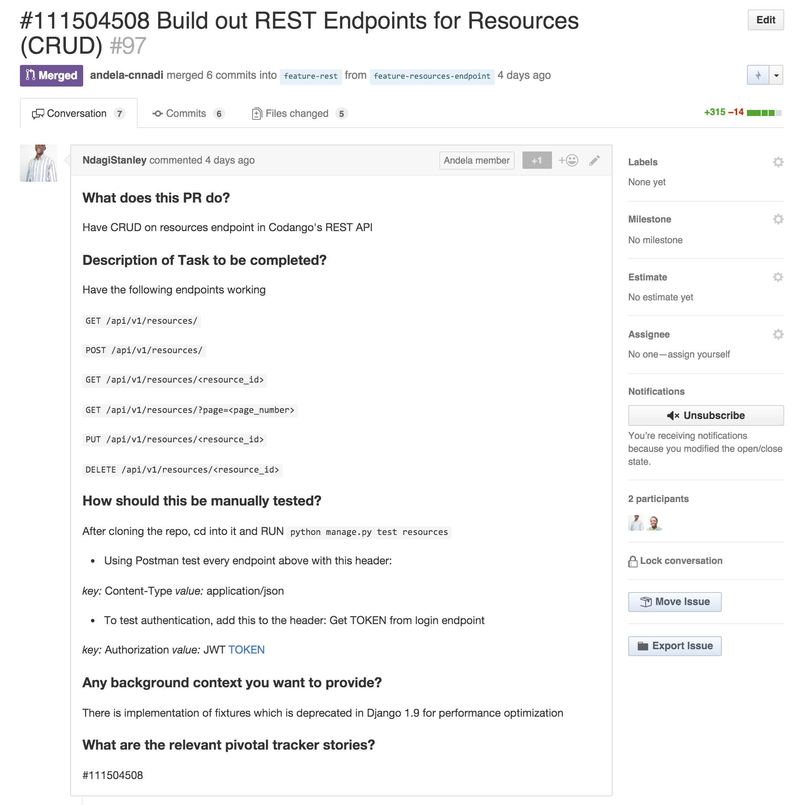

# Pull Request Naming and Description Conventions


### PR Title

---

The PR title should be named using the following format:

```
#[STORY_ID] [Story description]
```

### Example

```
#111504508 Build out REST Endpoints for Resources (CRUD)
```


### PR Description Template (Markdown)

---

The description of the PR should contain the following headings and corresponding content in Markdown format.

```
#### What does this PR do?
#### Description of Task to be completed?
#### How should this be manually tested?
#### Any background context you want to provide?
#### What are the relevant pivotal tracker stories?
#### Screenshots (if appropriate)
#### Questions:

```


### PR Description Template Example

---




### PR Etiquette

---

It is our belief that PR reviews should not negatively impact a team's ability to deliver features. PRs that take too much time to get reviewed can hinder on a team's progress. As such, we practice the following behaviours when raising PRs:

- When I raise a PR, I specifically assign a developer or engineering team as reviewer
- When I raise a PR, I notify the reviewer(s) on Slack in a public channel
- The reviewer(s) can re-assign the PR to someone else (e.g. TTL re-assigning to a Senior Engineer)
- The reviewer(s) has a 3 hours SLA to review the PR
- If SLA is not met, I can merge the unreviewed PR if and only if:
>- All the PR checks are passing (CircleCI, CodeClimate, Test Coverage)
>- I communicate in the appropriate Slack channel that I am merging an unreviewed PR
>- I immediately take ownership of fixing any issues that arise from merging the PR

